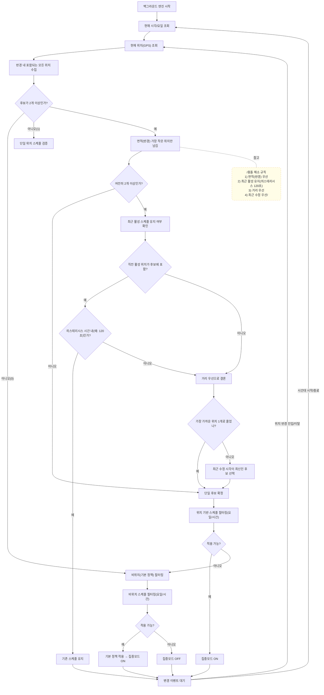

```mermaid
flowchart TD
    %% === 런타임 엔진 메인 루프 (면적 우선 + 최근 유지) ===
    R0[백그라운드 엔진 시작] --> T1[현재 시각/요일 조회]
    T1 --> G1["현재 위치(GPS) 조회"]
    G1 --> M1["반경 내 포함되는 모든 위치 수집"]

    M1 --> C1{후보가 2개 이상인가?}
    C1 -->|"아니오(0)"| B0["비위치(기본 정책) 필터링"]
    C1 -->|"아니오(1)"| L0["단일 위치 스케줄 검증"]
    C1 -->|예| S1["면적(반경) 가장 작은 위치만 남김"]

    %% 면적 우선 필터 이후
    S1 --> C2{여전히 2개 이상인가?}
    C2 -->|아니오| S2["단일 후보 확정"]
    C2 -->|예| RST["최근 활성 스케줄 유지 여부 확인"]

    %% 최근 활성 유지(히스테리시스)
    RST --> H1{직전 활성 위치가 후보에 포함?}
    H1 -->|예| H2{"히스테리시스 시간 내(예: 120초)인가?"}
    H2 -->|예| KEEP["기존 스케줄 유지"]
    H2 -->|아니오| DIST["거리 우선으로 결론"]
    H1 -->|아니오| DIST["거리 우선으로 결론"]

    %% 거리 우선 타이브레이커
    DIST --> C3{가장 가까운 위치 1개로 줄었나?}
    C3 -->|예| S2["단일 후보 확정"]
    C3 -->|아니오| MT["최근 수정 시각이 최신인 후보 선택"]

    MT --> S2

    %% 단일 후보 스케줄 적용
    S2 --> L3["위치 기반 스케줄 필터링(요일/시간)"]
    L3 --> C4{적용 가능?}
    C4 -->|예| ON[집중모드 ON]
    C4 -->|아니오| B0["비위치(기본 정책) 필터링"]

    %% 기본 정책 경로
    B0 --> B1["비위치 스케줄 필터링(요일/시간)"]
    B1 --> B2{적용 가능?}
    B2 -->|예| BON["기본 정책 적용 → 집중모드 ON"]
    B2 -->|아니오| OFF[집중모드 OFF]

    %% 이벤트 루프
    ON --> EV["변경 이벤트 대기"]
    BON --> EV
    KEEP --> EV
    OFF --> EV
    EV -->|"위치 반경 진입/이탈"| G1
    EV -->|"시간대 시작/종료"| T1

    %% 주석 노드
    N1["/충돌 해소 규칙<br/>1) 면적(반경) 우선<br/>2) 최근 활성 유지(히스테리시스 120초)<br/>3) 거리 우선<br/>4) 최근 수정 우선/"]
    S1 -. 참고 .- N1

    %% 스타일(선택)
    classDef note fill:#fffde7,stroke:#f0c36d,stroke-dasharray: 5 5,rx:10,ry:10;
    class N1 note;
```