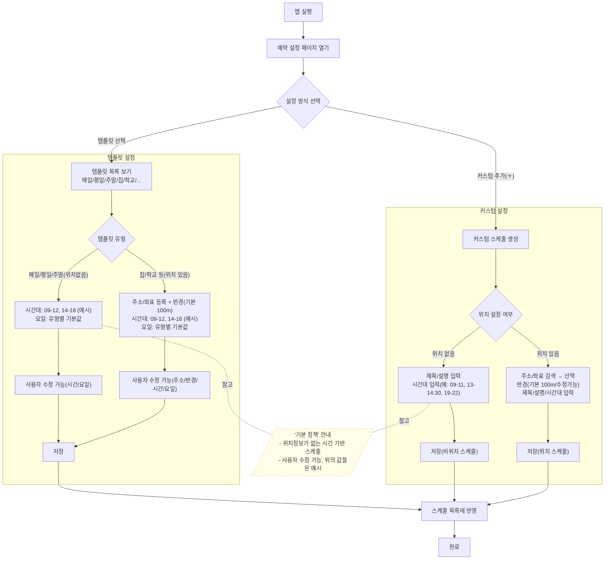

```mermaid
flowchart TD
    %% === 예약 설정 페이지 전반 흐름 ===
    A[앱 실행] --> B[예약 설정 페이지 열기]
    B --> C{설정 방식 선택}
    C -->|템플릿 선택| T1[템플릿 목록 보기<br/>매일/평일/주말/집/학교/...]
    C -->|"커스텀 추가(＋)"| K1[커스텀 스케줄 생성]

    %% 템플릿 분기
    subgraph T[템플릿 설정]
      direction TB
      T1 --> T2{템플릿 유형}
      T2 -->|"매일/평일/주말(위치없음)"| T3["시간대: 09-12, 14-18 (예시)<br/>요일: 유형별 기본값"]
      T2 -->|"집/학교 등(위치 있음)"| T4["주소/좌표 등록 + 반경(기본 100m)<br/>시간대: 09-12, 14-18 (예시)<br/>요일: 유형별 기본값"]
      T3 --> T5["사용자 수정 가능(시간/요일)"]
      T4 --> T6["사용자 수정 가능(주소/반경/시간/요일)"]
      T5 --> T7[저장]
      T6 --> T7[저장]
    end

    %% 커스텀 분기
    subgraph K[커스텀 설정]
      direction TB
      K1 --> K2{위치 설정 여부}
      K2 -->|위치 없음| K3["제목/설명 입력<br/>시간대 입력(예: 09-11, 13-14:30, 19-22)"]
      K2 -->|위치 있음| K4["주소/좌표 검색 → 선택<br/>반경(기본 100m/수정가능)<br/>제목/설명/시간대 입력"]
      K3 --> K5["저장(비위치 스케줄)"]
      K4 --> K6["저장(위치 스케줄)"]
    end

    T7 --> D[스케줄 목록에 반영]
    K5 --> D
    K6 --> D
    D --> E[완료]

    %% 노트 전용 노드 (호환성 높음)
    N1[/'기본 정책' 안내<br/>- 위치정보가 없는 시간 기반 스케줄<br/>- 사용자 수정 가능, 위의 값들은 예시/]
    T3 -. 참고 .- N1
    K3 -. 참고 .- N1

    %% 스타일(선택)
    classDef note fill:#fffde7,stroke:#f0c36d,stroke-dasharray: 5 5,rx:10,ry:10;
    class N1 note;
```