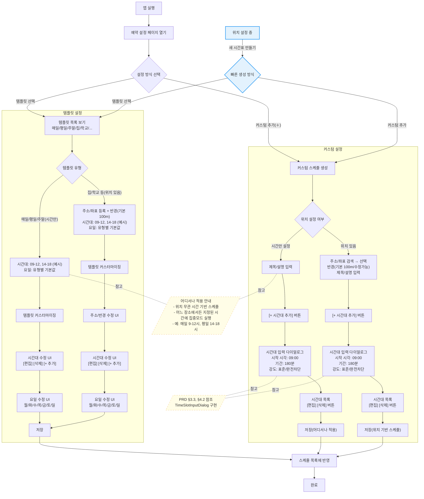

```mermaid
flowchart TD
    %% === 예약 설정 페이지 전반 흐름 ===
    A[앱 실행] --> B[예약 설정 페이지 열기]
    B --> C{설정 방식 선택}
    C -->|템플릿 선택| T1[템플릿 목록 보기<br/>매일/평일/주말/집/학교/...]
    C -->|"커스텀 추가(＋)"| K1[커스텀 스케줄 생성]

    %% 위치 설정 중 빠른 생성 경로 (QuickCreateScheduleDialog)
    L1[위치 설정 중] -->|"새 시간표 만들기"| Q1{빠른 생성 방식}
    Q1 -->|템플릿 선택| T1
    Q1 -->|커스텀 추가| K1

    %% 템플릿 분기
    subgraph T[템플릿 설정]
      direction TB
      T1 --> T2{템플릿 유형}
      T2 -->|"매일/평일/주말(시간만)"| T3["시간대: 09-12, 14-18 (예시)<br/>요일: 유형별 기본값"]
      T2 -->|"집/학교 등(위치 있음)"| T4["주소/좌표 등록 + 반경(기본 100m)<br/>시간대: 09-12, 14-18 (예시)<br/>요일: 유형별 기본값"]
      T3 --> T5[템플릿 커스터마이징]
      T4 --> T6[템플릿 커스터마이징]
      
      %% 템플릿 커스터마이징 상세 흐름
      T5 --> T5-1["시간대 수정 UI<br/>[편집] [삭제] [+ 추가]"]
      T5-1 --> T5-2["요일 수정 UI<br/>월/화/수/목/금/토/일"]
      T5-2 --> T7[저장]
      
      T6 --> T6-1["주소/반경 수정 UI"]
      T6-1 --> T6-2["시간대 수정 UI<br/>[편집] [삭제] [+ 추가]"]
      T6-2 --> T6-3["요일 수정 UI<br/>월/화/수/목/금/토/일"]
      T6-3 --> T7[저장]
    end

    %% 커스텀 분기
    subgraph K[커스텀 설정]
      direction TB
      K1 --> K2{위치 설정 여부}
      K2 -->|시간만 설정| K3[제목/설명 입력]
      K2 -->|위치 있음| K4["주소/좌표 검색 → 선택<br/>반경(기본 100m/수정가능)<br/>제목/설명 입력"]
      
      %% 커스텀 시간대 입력 UI 상세화
      K3 --> K3-1["[+ 시간대 추가] 버튼"]
      K3-1 --> K3-2["시간대 입력 다이얼로그<br/>시작 시각: 09:00<br/>기간: 180분<br/>강도: 표준/완전차단"]
      K3-2 --> K3-3["시간대 목록<br/>[편집] [삭제] 버튼"]
      K3-3 --> K5["저장(어디서나 적용)"]
      
      K4 --> K4-1["[+ 시간대 추가] 버튼"]
      K4-1 --> K4-2["시간대 입력 다이얼로그<br/>시작 시각: 09:00<br/>기간: 180분<br/>강도: 표준/완전차단"]
      K4-2 --> K4-3["시간대 목록<br/>[편집] [삭제] 버튼"]
      K4-3 --> K6["저장(위치 기반 스케줄)"]
    end

    T7 --> D[스케줄 목록에 반영]
    K5 --> D
    K6 --> D
    D --> E[완료]

    %% 노트 전용 노드 (호환성 높음)
    N1[/"어디서나 적용" 안내<br/>- 위치 무관 시간 기반 스케줄<br/>- 어느 장소에서든 지정된 시간에 집중모드 실행<br/>- 예: 매일 9-12시, 평일 14-18시/]
    T3 -. 참고 .- N1
    K3 -. 참고 .- N1

    N2[/PRD §3.3, §4.2 참조<br/>TimeSlotInputDialog 구현/]
    K3-2 -. 참고 .- N2
    K4-2 -. 참고 .- N2

    %% 스타일(선택)
    classDef note fill:#fffde7,stroke:#f0c36d,stroke-dasharray: 5 5,rx:10,ry:10;
    classDef quick fill:#e3f2fd,stroke:#2196f3,stroke-width:2px;
    class N1,N2 note;
    class L1,Q1 quick;
```