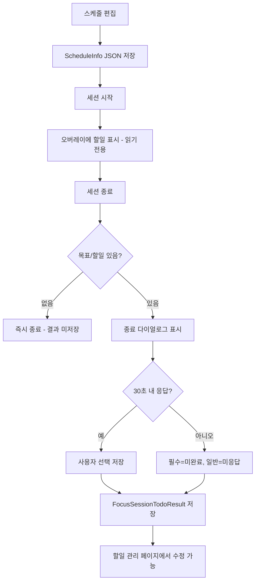

# 11. 추가 기능 제안 – 할 일(To-Do) 메모 결합 스케줄 관리

> **최종 수정일**: 2025-12-25 (6차 리뷰 검토 의견 반영)

## 1. 배경 및 목표
- 현재 스케줄(시간/위치 기반 자동 실행)은 집중 세션을 규정하지만, **왜 집중하는지**를 기록할 수단이 부족함.
- 스케줄 상세에 메모와 할 일(To-Do)을 녹여 사용자가 집중 이유·단계별 목표를 확인하도록 하여 **동기 부여·완료 감시** 기능을 강화한다.
- 집중 세션 종료 시 "할 일 달성률"을 리포트/포인트와 연결해 **성과 가시화**를 제공한다.

### 1.1 ⚠️ 디지털 디톡스 관점 핵심 고려사항

> **본 앱은 디지털 디톡스(스마트폰 중독 탈피)가 목적이므로, 할일 기능이 앱 사용을 늘리지 않도록 설계해야 함**

| 원칙 | 설명 |
|------|------|
| **최소 접촉** | 할일 확인을 위해 앱을 열 필요 없도록 설계 |
| **확인 vs 관리 분리** | 일상적 확인은 오버레이/알림, 관리만 앱 내에서 |
| **유혹의 순간 활용** | 차단된 앱 실행 시 목표를 상기시켜 동기부여 |
| **자동화** | 응답 없으면 "미응답" 처리, 추후 수정 가능 |

### 1.2 핵심 가치 제공

| 관점 | 현재 문제 | 개선 후 경험 |
|------|----------|-------------|
| 동기 부여 | 왜 집중하는지 모르고 단순히 앱만 차단 | 목표를 명확히 인지하고 집중 |
| 유혹 극복 | 차단 화면이 단순 "집중 모드" 텍스트만 표시 | "보고서 초안 완성" 같은 구체적 목표로 동기 상기 |
| 성과 가시화 | 집중 시간만 기록 | 할일 달성률까지 확인 가능 |
| 자동화 | 매번 수동 기록 필요 | 30초 무응답 시 자동 처리 |

## 2. 기능 범위 요약

> **🔄 4차 리뷰 반영**: MVP 범위 일관성 확보 (description/memo 제외)

| 분류 | 내용 | MVP |
| --- | --- | --- |
| 입력 확장 | `타이틀(title)` + `할 일 목록(todos)` | ✅ |
| 입력 확장 (v2) | `설명(description)`, `메모(memo)` | ❌ |
| 상세 보기 | 기존 시간·위치 정보 상단에 title/todos 노출 | ✅ |
| **🆕 차단 오버레이 연동** | 차단된 앱 실행 시 오버레이에 할일/목표 표시 | ✅ |
| 결과 기록 | 세션 종료 시 체크 상태 저장 (30초 무응답: **필수=미완료, 일반=미응답**) | ✅ |
| 동기화/공유 | 클라우드 백업, 외부 캘린더 내보내기 | ❌ v2 |

MVP는 입력·저장·상세 표시·**차단 오버레이 표시**·체크 상태 저장까지만 범위로 잡고, 통계 반영은 뒤 단계로 분할.

**🔄 5차 리뷰 반영: description/memo MVP 운영 규칙**
> MVP에서는 `description`, `memo` 필드를 스키마에 포함하되, **항상 빈 문자열(`""`)** 로 저장합니다.
> - UI에서는 입력란을 노출하지 않음
> - 검증 로직은 유지하되, 길이 0인 경우 항상 통과
> - v2에서 UI 추가 시 활성화

## 3. 데이터 스키마 설계 (단순화)

> **🔄 리뷰 반영**: MVP에서는 복잡한 정규화보다 JSON 컬럼으로 단순화

### 3.1 엔티티 확장 (단순화 버전)

기존 `TimeBasedAutoRun` / `LocationBasedAutoRun` 엔티티에 `scheduleInfoJson` 컬럼 추가.
`ScheduleInfo` 전체를 단일 JSON으로 직렬화/역직렬화한다.

> **⚠️ 주의**: Room 엔티티 필드명은 `scheduleInfoJson` (camelCase). 
> DB 컬럼명도 동일하게 유지하거나, `@ColumnInfo(name = "schedule_info_json")`로 명시.

```kotlin
// MVP 단순화 버전 - JSON 직렬화
data class ScheduleInfo(
    val title: String = "",
    val description: String = "",
    val memo: String = "",         // 🔄 7차: String? → String (항상 빈 문자열)
    val todos: List<ScheduleTodo> = emptyList()
)

// 할일 모델 (🔄 2차 리뷰: 검증 규칙 추가)
data class ScheduleTodo(
    val id: String = UUID.randomUUID().toString(),
    val content: String,
    val isRequired: Boolean = false,
    val orderIndex: Int = 0
) {
    companion object {
        const val MAX_TODO_COUNT = 5  // 🔄 데이터 레벨 제한
        const val MAX_CONTENT_LENGTH = 100
    }
}

// 입력 검증 규칙
object ScheduleInfoValidation {
    const val MAX_TITLE_LENGTH = 50
    const val MAX_DESCRIPTION_LENGTH = 200
    const val MAX_MEMO_LENGTH = 500
}

fun validateScheduleInfo(info: ScheduleInfo): ValidationResult {
    if (info.title.length > ScheduleInfoValidation.MAX_TITLE_LENGTH) {
        return ValidationResult.Error("목표는 ${ScheduleInfoValidation.MAX_TITLE_LENGTH}자 이내로 입력해주세요")
    }
    if (info.description.length > ScheduleInfoValidation.MAX_DESCRIPTION_LENGTH) {
        return ValidationResult.Error("설명은 ${ScheduleInfoValidation.MAX_DESCRIPTION_LENGTH}자 이내로 입력해주세요")
    }
    if ((info.memo?.length ?: 0) > ScheduleInfoValidation.MAX_MEMO_LENGTH) {
        return ValidationResult.Error("메모는 ${ScheduleInfoValidation.MAX_MEMO_LENGTH}자 이내로 입력해주세요")
    }
    if (info.todos.size > ScheduleTodo.MAX_TODO_COUNT) {
        return ValidationResult.Error("할일은 최대 ${ScheduleTodo.MAX_TODO_COUNT}개까지 등록 가능합니다")
    }
    info.todos.forEach { todo ->
        if (todo.content.length > ScheduleTodo.MAX_CONTENT_LENGTH) {
            return ValidationResult.Error("할일 내용은 ${ScheduleTodo.MAX_CONTENT_LENGTH}자 이내로 입력해주세요")
        }
    }
    return ValidationResult.Success
}
```

### 3.2 세션 결과 저장 (단순화)

> **🔄 2차 리뷰 반영**: FK 없이 스냅샷 저장으로 스케줄 삭제 시에도 히스토리 유지

**🔄 4차 리뷰 반영: 결과 저장 모델 통합 (TodoStatus 단일 JSON)**
```kotlin
@Entity(tableName = "focus_session_todo_result")
data class FocusSessionTodoResultEntity(
    @PrimaryKey
    val sessionId: String,
    val scheduleId: String,               // FK 없음 (스케줄 삭제 허용)
    val scheduleType: ScheduleType,       // TIME_BASED / LOCATION_BASED
    val scheduleTitleSnapshot: String,    // 스케줄 삭제 시 표시용 (🔄 fallback 규칙 추가)
    val todoResultsJson: String,          // 🔄 TodoStatus 리스트 단일 JSON으로 통합
    val completedAt: Long,
    val lastModifiedAt: Long? = null
)

// 완료 상태 분류
enum class TodoCompletionStatus {
    COMPLETED,      // 사용자가 명시적으로 완료 표시
    NOT_COMPLETED,  // 사용자가 명시적으로 미완료 표시
    NO_RESPONSE     // 30초 무응답 (통계에서 별도 처리)
}

enum class ScheduleType {
    TIME_BASED,
    LOCATION_BASED
}

// 🔄 4차 리뷰: Room enum TypeConverter
class ScheduleTypeConverter {
    @TypeConverter
    fun fromScheduleType(type: ScheduleType): String = type.name
    @TypeConverter
    fun toScheduleType(value: String): ScheduleType = ScheduleType.valueOf(value)
}

class TodoCompletionStatusConverter {
    @TypeConverter
    fun fromStatus(status: TodoCompletionStatus): String = status.name
    @TypeConverter
    fun toStatus(value: String): TodoCompletionStatus = TodoCompletionStatus.valueOf(value)
}
```

**🔄 4차 리뷰: scheduleTitleSnapshot 빈 값 fallback**
```kotlin
fun getScheduleTitleSnapshot(info: ScheduleInfo, scheduleName: String): String {
    return when {
        info.title.isNotBlank() -> info.title
        scheduleName.isNotBlank() -> scheduleName  // 스케줄 기본 라벨
        else -> "미지정 스케줄"
    }
}
```

**🔄 3차 리뷰 반영: TodoStatus 모델 정의**
```kotlin
// 할일 상태 저장 모델
data class TodoStatus(
    val id: String,
    val content: String,
    val isRequired: Boolean,
    val status: TodoCompletionStatus,
    val isGoal: Boolean = false  // 메인 목표 vs 세부 할일 구분
)
```

**🔄 6차 리뷰 반영: buildTodoResult 로직 수정 (목표+할일 동시 시 목표 상태 자동 도출)**
```kotlin
fun buildTodoResult(
    scheduleId: String,
    info: ScheduleInfo,
    userResponses: Map<String, TodoCompletionStatus>
): List<TodoStatus>? {
    
    // 목표/할일 없는 경우: 저장 생략
    if (info.todos.isEmpty() && info.title.isBlank()) {
        return null
    }
    
    val result = mutableListOf<TodoStatus>()
    
    // 세부 할일 추가
    val todoStatuses = info.todos.map { todo ->
        TodoStatus(
            id = todo.id,
            content = todo.content,
            isRequired = todo.isRequired,
            status = getStatusWithRequiredFallback(userResponses[todo.id], todo.isRequired),
            isGoal = false
        )
    }
    
    // 목표 처리
    if (info.title.isNotBlank()) {
        val goalId = "goal:$scheduleId"
        val goalStatus = if (todoStatuses.isEmpty()) {
            // 목표만 있는 경우: 사용자 입력 또는 fallback
            getStatusWithRequiredFallback(userResponses[goalId], isRequired = true)
        } else {
            // 🔄 6차: 목표+할일 동시 존재 시 목표 상태 자동 도출
            deriveGoalStatusFromTodos(todoStatuses)
        }
        result.add(TodoStatus(
            id = goalId,
            content = info.title,
            isRequired = true,
            status = goalStatus,
            isGoal = true
        ))
    }
    
    result.addAll(todoStatuses)
    return result
}

// 🔄 6차 리뷰: 목표 상태 자동 도출 규칙
// - 모든 필수 할일 COMPLETED → 목표 COMPLETED
// - 하나라도 NOT_COMPLETED → 목표 NOT_COMPLETED  
// - 필수 할일 없으면 전체 완료율로 판단
fun deriveGoalStatusFromTodos(todos: List<TodoStatus>): TodoCompletionStatus {
    val requiredTodos = todos.filter { it.isRequired }
    
    return if (requiredTodos.isNotEmpty()) {
        // 필수 할일 기준
        if (requiredTodos.all { it.status == TodoCompletionStatus.COMPLETED }) {
            TodoCompletionStatus.COMPLETED
        } else {
            TodoCompletionStatus.NOT_COMPLETED
        }
    } else {
        // 필수 할일 없으면 전체 기준
        if (todos.all { it.status == TodoCompletionStatus.COMPLETED }) {
            TodoCompletionStatus.COMPLETED
        } else if (todos.any { it.status == TodoCompletionStatus.NOT_COMPLETED }) {
            TodoCompletionStatus.NOT_COMPLETED
        } else {
            TodoCompletionStatus.NO_RESPONSE
        }
    }
}

// 필수 항목 미응답 시 NOT_COMPLETED 처리
fun getStatusWithRequiredFallback(
    userResponse: TodoCompletionStatus?,
    isRequired: Boolean
): TodoCompletionStatus {
    return userResponse ?: if (isRequired) {
        TodoCompletionStatus.NOT_COMPLETED
    } else {
        TodoCompletionStatus.NO_RESPONSE
    }
}
```

**🔄 6차 리뷰: 목표 상태 수집 규칙 요약**
| 조건 | 목표 상태 결정 방식 |
|------|-------------------|
| 목표만 있음 | 사용자 입력 (예/아니오) |
| **목표 + 할일 있음** | **할일 결과에서 자동 도출** |
| 할일만 있음 | 목표 없음 (isGoal 생성 안 함) |
}
```

**🔄 5차 리뷰: 목표/할일 조합별 저장 정책**
| 조건 | 동작 | 데이터 |
|------|------|------|
| `title` 비어있고 `todos` 비어있음 | 결과 저장 생략 | `FocusSessionTodoResult` 미생성 |
| `title`만 있음 | 단일 TodoStatus 저장 | `isGoal = true` |
| `todos`만 있음 | 할일 목록 저장 | `isGoal = false` 리스트 |
| **`title` + `todos` 둘 다 있음** | **목표 + 할일 모두 저장** | **`isGoal=true` 1개 + `isGoal=false` N개** |

### 3.3 마이그레이션 전략

| 단계 | 내용 | 리스크 |
|------|------|--------|
| 1 | `time_based_auto_run`에 `schedule_info_json` 컬럼 추가 | 낮음 |
| 2 | `location_based_auto_run`에 동일 컬럼 추가 | 낮음 |
| 3 | `focus_session_todo_result` 테이블 신규 생성 | 낮음 |

> **🔄 2차 리뷰 반영**: Migration 실패 시 동작 정의

### 3.4 Migration 실패 시 Fallback 처리

```kotlin
// DatabaseBuilder 설정
Room.databaseBuilder(context, AppDatabase::class.java, "detoxy_db")
    .addMigrations(MIGRATION_X_Y)
    .fallbackToDestructiveMigrationOnDowngrade()  // 다운그레이드 시만 허용
    .build()

// Migration 실패 감지 및 처리
sealed class MigrationState {
    object Success : MigrationState()
    object Failed : MigrationState()
}

// 실패 시 동작
when (migrationState) {
    MigrationState.Failed -> {
        // 1. 할일 기능만 비활성화 (기존 타이머/스케줄은 정상 동작)
        // 2. 설정 화면에 "데이터 복구 필요" 배너 표시
        // 3. 앱 업데이트 유도 다이얼로그 표시
    }
}
```

## 4. 런타임 상태 및 데이터 흐름

> **🔄 5차 리뷰 반영**: 저장 조건 분기 추가



> **중요**: 세션 진행 중에는 할일 체크 불가 (Progress 테이블 없음). **세션 종료 시에만** 체크 가능.
> **목표/할일 없는 스케줄**은 다이얼로그 없이 즉시 종료, `FocusSessionTodoResult` 미생성.

## 5. API/도메인 계층 변경
- `domain/model/AutoRunSchedule` DTO에 `scheduleInfo` 필드 반영.
- UseCase: `CreateTimeBasedAutoRunUseCase`, `UpdateLocationBasedAutoRunUseCase` 등에 파라미터 확장.
- JSON 직렬화/역직렬화 유틸리티 추가 (`ScheduleInfoJsonConverter`).
- **🔄 할일 개수/길이 검증 로직 추가** (`TodoValidationUseCase`).
- `FocusSessionTodoResultEntity`에 `scheduleType`, `scheduleTitleSnapshot`, `lastModifiedAt` 반영.

**🔄 3차 리뷰 반영: TypeConverter 구현 가이드**
```kotlin
// Room TypeConverter 예시
class ScheduleInfoConverter {
    private val gson = Gson()

    @TypeConverter
    fun fromScheduleInfo(info: ScheduleInfo?): String? =
        info?.let { gson.toJson(it) }

    @TypeConverter
    fun toScheduleInfo(json: String?): ScheduleInfo? =
        json?.let {
            try { gson.fromJson(it, ScheduleInfo::class.java) }
            catch (e: Exception) { ScheduleInfo() }  // fallback: 빈 객체
        }
}
```

**🔄 3차 리뷰 반영: 스케줄 삭제 시 결과 데이터 정책**
| 정책 | 설명 |
|------|------|
| 결과 보존 | `FocusSessionTodoResult`는 스케줄 삭제해도 유지 (히스토리 보존) |
| 스냅샷 표시 | `scheduleTitleSnapshot`으로 삭제된 스케줄도 표시 가능 |
| 자동 정리 (v2) | 90일 이상 지난 결과 데이터 자동 정리 (선택적, 차기 단계) |

## 6. UI/UX 설계

### 6.1 스케줄 생성/편집 - 목표 설정 (통합 UX)

> **설계 원칙**: 메인 목표 텍스트 1개 + 선택적 세부 할일 (최대 5개)

**🔄 3차 리뷰 반영: MVP 범위 결정 - description/memo 제외**

> **결정**: `description`, `memo` 필드는 MVP에서 제외. `title` + `todos`만으로 충분히 기능함.

| 필드 | 역할 | MVP 범위 | 오버레이 표시 |
|------|------|----------|---------------|
| `title` | 메인 목표 (선택) | ✅ 포함 | ✅ 표시 |
| `description` | 목표 상세 설명 | ❌ **v2** | ❌ 미표시 |
| `memo` | 개인 메모 | ❌ **v2** | ❌ 미표시 |
| `todos` | 세부 할일 목록 (선택) | ✅ 포함 | 최대 3개 표시 |

```
┌─────────────────────────────────────────────────────────┐
│  ← 스케줄 만들기                                        │
├─────────────────────────────────────────────────────────┤
│                                                         │
│  🎯 집중 목표 (선택)                                    │
│  ┌─────────────────────────────────────────────────┐   │
│  │ 오늘 할 일을 입력하세요...                       │   │
│  │                                                 │   │
│  │ 보고서 초안 완성하기                            │   │
│  └─────────────────────────────────────────────────┘   │
│                                                         │
│  [ + 세부 항목 추가 ]  ← 필요 시 체크리스트로 확장      │
│                                                         │
│  ⏰ 시간 설정                                           │
│  ┌─────────────────────────────────────────────────┐   │
│  │  시작: [09:00]  집중 시간: [2시간]               │   │
│  │  반복: [월] [화] [수] [목] [금]                  │   │
│  └─────────────────────────────────────────────────┘   │
│                                                         │
├─────────────────────────────────────────────────────────┤
│            [ 취소 ]              [ 저장 ]               │
└─────────────────────────────────────────────────────────┘
```

#### "세부 항목 추가" 클릭 시 확장

```
│  📋 세부 할일 (5개 중 2개 사용)                          │ ← 🔄 개수 표시
│  ┌───────────────────────────────────────────┐         │
│  │ 1. │ 이메일 확인 및 답장      │필수│ ✕ │         │
│  └───────────────────────────────────────────┘         │
│  ┌───────────────────────────────────────────┐         │
│  │ 2. │ 보고서 초안 작성         │ □ │ ✕ │         │
│  └───────────────────────────────────────────┘         │
│  ┌─────────────────────────────────────────┐           │
│  │      ＋ 할 일 추가 (3개 남음)            │           │ ← 🔄 잔여 개수
│  └─────────────────────────────────────────┘           │
```

> **할일 5개 제한 근거**:
> - 밀러의 법칙 (7±2): 인간의 단기 기억 용량 고려
> - 오버레이 표시 공간 제약 (최대 3개 표시)
> - 집중 세션 동안 현실적으로 완료 가능한 수

---

### 6.2 ⭐ 차단 오버레이 할일 리마인더 (핵심 기능)

> **🔄 2차 리뷰 반영**: 프라이버시 보호 옵션 추가

**🔄 3차 리뷰 반영: 오버레이 텍스트 축약 규칙**
```kotlin
object OverlayDisplayRules {
    const val MAX_TODO_DISPLAY_COUNT = 3      // 오버레이에 표시할 최대 할일 개수
    const val MAX_TODO_TEXT_LENGTH = 20       // 할일 텍스트 최대 길이 (초과 시 "...")
    const val MAX_GOAL_TEXT_LENGTH = 30       // 목표 텍스트 최대 길이
}

fun truncateForOverlay(text: String, maxLength: Int): String =
    if (text.length > maxLength) "${text.take(maxLength)}..." else text
```

**기본 표시 (메인 목표만, 프라이버시 보호):**
```
┌─────────────────────────────────────────────────────────┐
│  ░                                                   ░  │
│  ░              🔒 집중 모드 실행 중                  ░  │
│  ░                   1:23:45                         ░  │
│  ░                                                   ░  │
│  ░   ┌─────────────────────────────────────────┐    ░  │
│  ░   │  🎯 오늘의 목표                         │    ░  │
│  ░   │  "보고서 초안 완성하기"                 │    ░  │
│  ░   └─────────────────────────────────────────┘    ░  │
│  ░                                                   ░  │
│  ░          💡 목표에 집중하세요                     ░  │
│  ░                                                   ░  │
└─────────────────────────────────────────────────────────┘
```

**세부 할일 표시 (최대 3개 + 축약):**
```
│  ░   ┌─────────────────────────────────────────┐    ░  │
│  ░   │  📋 지금 해야 할 일                      │    ░  │
│  ░   │  □ 이메일 확인 [필수]                    │    ░  │
│  ░   │  □ 보고서 초안 작성                      │    ░  │
│  ░   │  □ 팀 미팅 준비 [필수]                   │    ░  │
│  ░   │  ...외 2개                              │    ░  │
│  ░   └─────────────────────────────────────────┘    ░  │
```

**🔄 프라이버시 보호 설정 (설정 화면):**
| 옵션 | 설명 | 기본값 |
|------|------|--------|
| 오버레이에 목표 표시 | 메인 목표 텍스트 표시 | ON |
| 오버레이에 세부 할일 표시 | 개별 할일 항목 표시 | OFF |
| 목표 숨기기 | 민감한 목표 비표시 (이모지만) | OFF |

**우선순위 규칙**
1. 목표 숨기기 = ON → 모든 텍스트 숨김 (이모지만 표시)
2. 오버레이에 목표 표시 = OFF → 목표/할일 모두 숨김
3. 세부 할일 표시 = OFF → 목표만 표시
4. 세부 할일 표시 = ON → 목표 + 할일 표시

> **구현**: `PreferenceManager.showTodoOnOverlay`, `PreferenceManager.showDetailedTodoOnOverlay`

---

### 6.3 세션 종료 다이얼로그 (개별 할일 체크 UX)

> **🔄 2차 리뷰 반영**: 개별 할일 완료 상태 수집 UX 명확화

**🔄 3차 리뷰 반영: 세션 종료 다이얼로그 표시 조건**
| 조건 | 동작 |
|------|------|
| 목표 + 할일 있음 | 체크리스트 다이얼로그 표시 |
| 목표만 있음 | 예/아니오 다이얼로그 표시 |
| 목표/할일 없음 | 다이얼로그 생략, 즉시 종료 |

**메인 목표만 있는 경우:**
```
┌─────────────────────────────────────────────────────────┐
│                     🎉                                  │
│              집중 세션 완료!                            │
│         ─────────────────────────────                   │
│              2시간 00분 집중                            │
│                                                         │
│         목표: "보고서 초안 완성하기"                    │
│                                                         │
│         ✅ 목표를 달성하셨나요?                            │
│         ┌─────────┐        ┌─────────┐                 │
│         │  예 ✅  │        │ 아니오  │                 │
│         └─────────┘        └─────────┘                 │
│                                                         │
│         ⏱️ 30초 후 "미완료"로 기록됩니다                │
│         ━━━━━━━━━━━━━━━━━━━━░░░░░░                      │
│         (목표는 필수 항목이므로 미응답 시 미완료 처리)       │
│         💡 할일 관리 페이지에서 수정 가능               │
└─────────────────────────────────────────────────────────┘
```

> **🔄 5차 리뷰 반영**: 목표는 필수 항목(`isRequired=true`)이므로, 무응답 시 **"미완료(NOT_COMPLETED)"** 로 처리됨.
> UI 문구를 "미응답" 대신 **"미완료"**로 변경하여 저장 로직과 일치시킴.

**세부 할일이 있는 경우 (개별 체크 UI):**
```
┌─────────────────────────────────────────────────────────┐
│                     🎉                                  │
│              집중 세션 완료!                            │
│         ─────────────────────────────                   │
│                                                         │
│         ✅ 완료한 할 일을 체크하세요                    │
│         ┌─────────────────────────────┐                │
│         │  □ → ✓ 이메일 확인 [필수]   │ ← 탭하여 토글  │
│         │  □ → ✓ 보고서 초안 작성     │                │
│         │  □    팀 미팅 준비 [필수]   │ ← 체크 안함    │
│         └─────────────────────────────┘                │
│                                                         │
│         ⏱️ 30초 후 현재 상태로 저장                     │
│         ━━━━━━━━━━━━━━━━━━━━░░░░░░                      │
│                                                         │
│         [ 완료 ]                                        │
│                                                         │
│  🔄 체크 안 한 항목: "미응답" 처리 (필수 항목은 미완료) │
└─────────────────────────────────────────────────────────┘
```

**30초 무응답 시 처리 로직:**
```kotlin
fun handleNoResponse(todos: List<ScheduleTodo>): Map<String, TodoCompletionStatus> {
    return todos.associate { todo ->
        todo.id to if (todo.isRequired) {
            TodoCompletionStatus.NOT_COMPLETED  // 필수 항목은 미완료 처리
        } else {
            TodoCompletionStatus.NO_RESPONSE    // 일반 항목은 미응답 처리
        }
    }
}
```

---

### 6.4 스케줄 시작 알림

> **🔄 2차 리뷰 반영**: "10분 뒤 알려주기" 동작 명확화

```
┌─────────────────────────────────────────────────────────┐
│  📱 Allday Detoxy                               지금    │
├─────────────────────────────────────────────────────────┤
│                                                         │
│  🎯 오전 집중 시간 시작                                 │
│                                                         │
│  ┌─────────────────────────────────────────────────┐   │
│  │  오늘의 목표: "보고서 초안 완성하기"             │   │
│  └─────────────────────────────────────────────────┘   │
│                                                         │
│  ┌─────────┐   ┌─────────────────────┐                 │
│  │  시작   │   │  10분 뒤 알려주기   │                 │
│  └─────────┘   └─────────────────────┘                 │
│                                                         │
└─────────────────────────────────────────────────────────┘
```

**"10분 뒤 알려주기" 동작 정의:**
| 버튼 | 동작 | 세션 상태 |
|------|------|-----------|
| **시작** | 즉시 세션 시작, 차단 활성화 | `RUNNING` |
| **10분 뒤 알려주기** | 알림 10분 연기, 세션 미시작 | `PENDING` |

> 스누즈 버튼은 세션을 **지연**시키며, 10분 후 동일 알림 재표시. 최대 3회까지 스누즈 가능.
> 3회 초과 시 해당 세션은 **SKIPPED**로 기록하고 다음 스케줄로 이동.

---

### 6.5 색상 및 스타일 가이드

| 요소 | Light Mode | Dark Mode |
|------|------------|-----------|
| 섹션 카드 배경 | surfaceVariant | surfaceVariant |
| 할 일 항목 배경 | surface (50% alpha) | surface (50% alpha) |
| 완료된 항목 배경 | primaryContainer (30%) | primaryContainer (30%) |
| 필수 라벨 | error color | error color |
| 완료 체크마크 | primary | primary |

---

### 6.6 인터랙션 및 애니메이션

| 인터랙션 | 애니메이션 |
|----------|------------|
| 섹션 접기/펼치기 | expandVertically (300ms) |
| 할 일 추가 | fadeIn + slideInVertically |
| 할 일 삭제 | fadeOut + slideOutHorizontally |
| 체크박스 토글 | scale (1.0 → 1.2 → 1.0, 150ms) |
| 완료 상태 전환 | crossfade (200ms) |

---

### 6.7 접근성 고려사항

- 모든 체크박스에 `contentDescription` 제공 ("할 일: {내용}, {완료/미완료}")
- 필수 항목은 스크린리더에서 "필수 항목"으로 안내
- 터치 영역 최소 48dp × 48dp 확보
- 색상만으로 정보 전달하지 않음 (아이콘 + 텍스트 병행)

## 7. 통계/리포트 연동 (차기 단계)

- `FocusSessionTodoResult` 기반 지표:
  - 세션별 할 일 완료율 = COMPLETED / (전체 - NO_RESPONSE)
  - **미응답률** = NO_RESPONSE / 전체 (별도 표시)
  - 필수 항목 달성률 vs 전체 달성률
- **전체 미응답 시 완료율은 N/A로 표시**
- Report 화면에 "이번 주 평균 할 일 완료율", "필수 항목 미달성 Top 스케줄" 카드 추가.

**🔄 3차 리뷰 반영: isGoal 통계 처리**
| 항목 | 처리 방식 |
|------|----------|
| 메인 목표 (isGoal=true) | 세부 할일과 동일하게 완료율 계산에 포함 |
| 별도 지표 | "이번 주 목표 달성 5/7" 같은 형태로 표시 |
| 표시 위치 | 리포트 상단 요약 카드 |

## 8. MVP 범위 정의

> **🔄 4차 리뷰 반영**: 모든 섹션과 MVP 범위 일관성 확보

| 영역 | 포함 | 비고 |
| --- | --- | --- |
| 입력/저장 | ✅ | **title + todos**만 (description/memo는 v2) |
| 상세 표시 | ✅ | **Title + Todo Checklist**만 (description/memo는 v2) |
| **차단 오버레이 할일 표시** | ✅ | 최대 3개 + 축약 + 프라이버시 옵션 |
| **세션 종료 개별 체크** | ✅ | 30초 타이머 + 개별 할일 체크 UI |
| **30초 미응답 처리** | ✅ | 필수=미완료, 일반=미응답 |
| 세션 중 체크 | ❌ | 세션 종료 시에만 (디톡스 보호) |
| description/memo | ❌ | v2에서 추가 |
| 통계 연동 | ❌ | 차기 단계 |

---

## 9. 🆕 할일 관리 페이지 (개선안)

> **🔄 8차 리뷰 반영**: "계획된 할일" + "완료된 할일" 분리 → **오늘의 할일 통합 체크리스트**로 변경

### 9.1 설계 방향

| 기존 구조 | 개선 구조 |
|----------|----------|
| 계획된 할일 / 완료된 할일 분리 | **통합 체크리스트** |
| 과거 이력 모두 표시 | **오늘 기준**만 표시 |
| 필터 없음 | **상태별 필터** 제공 |

**변경 근거:**
- 과거 이력은 데이터 양이 많아 별도 리포트 페이지에서 관리 (향후 구현)
- 오늘 할일에 집중하여 실용성 향상
- 체크리스트 형태로 직관적 UX 제공

### 9.2 현재 앱 네비게이션 구조

```
┌─────────────────────────────────────────────────────────┐
│   🎯 타이머  │  📅 스케줄  │  ⭐ 리포트  │  ⚙️ 설정    │
│    (Tab 0)  │   (Tab 1)   │   (Tab 2)   │   (Tab 3)   │
└─────────────────────────────────────────────────────────┘
```

### 9.3 할일 관리 페이지 위치: 스케줄 탭 내 서브 탭

```
스케줄 탭 (Tab 1) 진입 시:
┌─────────────────────────────────────────────────────────┐
│  📅 스케줄                                              │
├─────────────────────────────────────────────────────────┤
│  ┌───────────────┐  ┌───────────────────┐              │
│  │  전체 스케줄  │  │  📋 할일 관리      │              │
│  └───────────────┘  └───────────────────┘              │
└─────────────────────────────────────────────────────────┘
```

### 9.4 🆕 오늘의 할일 통합 체크리스트 UI

```
┌─────────────────────────────────────────────────────────┐
│  📋 오늘의 할일                           12월 26일 목  │
├─────────────────────────────────────────────────────────┤
│  ┌────────┐ ┌────────┐ ┌────────┐ ┌────────┐           │
│  │ 전체 8 │ │ 대기 3 │ │ 완료 4 │ │ 미완료 1│           │
│  └────────┘ └────────┘ └────────┘ └────────┘           │
├─────────────────────────────────────────────────────────┤
│                                                         │
│  🏢 회사업무                                ⏰ 09:00    │
│  ┌─────────────────────────────────────────────────┐   │
│  │  🎯 보고서 초안 완성하기                         │   │
│  ├─────────────────────────────────────────────────┤   │
│  │  ☑️ 테스트                          [완료]        │   │
│  │  ☐ 테스트2                         [대기]        │   │
│  └─────────────────────────────────────────────────┘   │
│                                                         │
│  🏠 집 매일                                 ⏰ 17:00    │
│  ┌─────────────────────────────────────────────────┐   │
│  │  🎯 안정화테스트, 글자수체크하기                 │   │ ← 여러 목표 병합 표시
│  ├─────────────────────────────────────────────────┤   │
│  │  ☑️ 숙제1                           [완료]        │   │
│  │  ✖️ tdd 관련 진행                  [미완료]       │   │ ← 탭하여 수정 가능
│  │  ☑️ 사용자 환경 테스트              [완료]        │   │
│  │  ⚪ 기타                           [미응답]       │   │ ← 탭하여 수정 가능
│  │  ☑️ 하하하하헝                      [완료]        │   │
│  │  ☐ 흐흐흐흘흐                      [대기]        │   │
│  └─────────────────────────────────────────────────┘   │
│                                                         │
└─────────────────────────────────────────────────────────┘
```

### 9.5 할일 상태 정의

| 상태 | 아이콘 | 색상 | 설명 | 발생 조건 |
|------|-------|------|------|----------|
| 대기 | ☐ | 회색 | 오늘 예정, 아직 세션 안 함 | 오늘 예정된 시간대, 세션 미완료 |
| 완료 | ☑️ | 초록 | 오늘 세션에서 완료 체크 | 사용자가 완료 표시 |
| 미완료 | ✖️ | 빨강 | 오늘 세션에서 미완료 체크 | 사용자가 미완료 표시 / 필수 항목 무응답 |
| 미응답 | ⚪ | 회색 | 오늘 세션에서 응답 안 함 | 일반 항목 무응답 |

### 9.6 필터 기능

```kotlin
enum class TodoFilter {
    ALL,           // 전체
    PENDING,       // 대기 (아직 세션 안 함)
    COMPLETED,     // 완료
    INCOMPLETE     // 미완료 + 미응답
}
```

| 필터 | 표시 조건 |
|------|----------|
| 전체 | 모든 할일 표시 |
| 대기 | 세션 미완료 시간대의 할일 |
| 완료 | COMPLETED 상태 할일 |
| 미완료 | NOT_COMPLETED + NO_RESPONSE 상태 할일 |

### 9.7 데이터 통합 로직

```kotlin
data class TodayTodoItem(
    val scheduleId: String,
    val scheduleTitle: String,
    val scheduledTime: LocalTime?,      // 예정 시간 (null = 위치 기반)
    val goal: String?,                   // 병합된 목표 (여러 시간대 목표 합침)
    val todoContent: String,
    val status: TodayTodoStatus,
    val isRequired: Boolean,
    val isGoal: Boolean,
    val sourceType: TodoSourceType,      // 어디서 온 데이터인지
    val sessionId: String? = null        // 완료된 경우 세션 ID
)

enum class TodayTodoStatus {
    PENDING,        // 대기 (계획된 할일, 세션 미완료)
    COMPLETED,      // 완료
    NOT_COMPLETED,  // 미완료
    NO_RESPONSE     // 미응답
}

enum class TodoSourceType {
    PLANNED,        // 계획된 할일 (TimeBasedAutoRun/LocationBasedAutoRun)
    SESSION_RESULT  // 세션 결과 (FocusSessionTodoResult)
}
```

### 9.8 오늘 기준 필터링 로직

```kotlin
fun getTodayTodos(
    plannedTodos: List<PlannedTodo>,
    todayResults: List<FocusSessionTodoResultEntity>
): List<TodayTodoItem> {
    val today = LocalDate.now()
    val currentDayOfWeek = today.dayOfWeek
    
    val result = mutableListOf<TodayTodoItem>()
    
    // 1. 오늘 완료된 세션 결과 추가
    todayResults.forEach { sessionResult ->
        val todoStatuses = TodoResultConverter.fromJson(sessionResult.todoResultsJson)
        todoStatuses.forEach { status ->
            result.add(TodayTodoItem(
                scheduleId = sessionResult.scheduleId,
                scheduleTitle = sessionResult.scheduleTitleSnapshot,
                scheduledTime = null, // 이미 완료됨
                goal = if (status.isGoal) status.content else null,
                todoContent = status.content,
                status = when (status.status) {
                    TodoCompletionStatus.COMPLETED -> TodayTodoStatus.COMPLETED
                    TodoCompletionStatus.NOT_COMPLETED -> TodayTodoStatus.NOT_COMPLETED
                    TodoCompletionStatus.NO_RESPONSE -> TodayTodoStatus.NO_RESPONSE
                },
                isRequired = status.isRequired,
                isGoal = status.isGoal,
                sourceType = TodoSourceType.SESSION_RESULT,
                sessionId = sessionResult.sessionId
            ))
        }
    }
    
    // 2. 계획된 할일 중 오늘 예정이고 아직 세션 안 한 것 추가
    plannedTodos.forEach { planned ->
        // 이미 세션 완료된 scheduleId는 제외
        val alreadyCompleted = result.any { it.scheduleId == planned.scheduleId }
        if (!alreadyCompleted && planned.isScheduledForToday(currentDayOfWeek)) {
            // 목표 추가
            if (planned.scheduleInfo.title.isNotBlank()) {
                result.add(TodayTodoItem(
                    scheduleId = planned.scheduleId,
                    scheduleTitle = planned.scheduleTitle,
                    scheduledTime = planned.scheduledTime,
                    goal = planned.scheduleInfo.title,
                    todoContent = planned.scheduleInfo.title,
                    status = TodayTodoStatus.PENDING,
                    isRequired = true,
                    isGoal = true,
                    sourceType = TodoSourceType.PLANNED
                ))
            }
            // 할일 추가
            planned.scheduleInfo.todos.forEach { todo ->
                result.add(TodayTodoItem(
                    scheduleId = planned.scheduleId,
                    scheduleTitle = planned.scheduleTitle,
                    scheduledTime = planned.scheduledTime,
                    goal = null,
                    todoContent = todo.content,
                    status = TodayTodoStatus.PENDING,
                    isRequired = todo.isRequired,
                    isGoal = false,
                    sourceType = TodoSourceType.PLANNED
                ))
            }
        }
    }
    
    return result
}
```

### 9.9 수정 가능 항목

| 상태 | 수정 가능 | 비고 |
|------|----------|------|
| PENDING | ❌ | 세션 시작 전이므로 수정 불필요 |
| COMPLETED | ❌ | 이미 완료됨 |
| NOT_COMPLETED | ✅ | 탭하여 완료로 변경 가능 |
| NO_RESPONSE | ✅ | 탭하여 완료/미완료 선택 가능 |

**수정 UX:**
```
┌─────────────────────────────────────────────────────────┐
│  ⚪ 기타 [미응답] ← 탭                                   │
│  ┌─────────────────────────────────────────────────┐   │
│  │  상태 변경                                        │   │
│  │  ┌─────────┐        ┌─────────┐                 │   │
│  │  │  완료 ✅ │        │ 미완료 ✖️│                 │   │
│  │  └─────────┘        └─────────┘                 │   │
│  └─────────────────────────────────────────────────┘   │
└─────────────────────────────────────────────────────────┘
```

### 9.10 디톡스 보호 장치

| 보호 장치 | 설명 |
|-----------|------|
| 세션 중 수정 제한 | 집중 세션 진행 중에는 할일 수정 버튼 비활성화 (목록 조회는 가능) |
| 확인 vs 관리 분리 | 확인은 오버레이, 관리만 페이지에서 |
| 오늘 기준만 표시 | 과거 이력은 리포트 페이지에서 별도 조회 (향후 구현) |

### 9.11 향후 확장 계획

| 기능 | 설명 | 우선순위 |
|------|------|----------|
| 과거 이력 조회 | 리포트 페이지에서 날짜별 할일 이력 조회 | v2 |
| 주간 통계 | 이번 주 할일 완료율, 목표 달성률 | v2 |
| 할일 검색 | 키워드로 과거 할일 검색 | v2 |

---

## 10. 🆕 템플릿 스케줄 할일 연계

```kotlin
data class TemplateTimeSlot(
    val hour: Int,
    val minute: Int,
    val durationMinutes: Int,
    val presetType: String,
    val enabledDays: List<DayOfWeek>,
    val label: String? = null,
    val defaultGoal: String? = null,
    val defaultTodoItems: List<TemplateTodo>? = null
)

data class TemplateTodo(
    val content: String,
    val isRequired: Boolean = false
)
```

---

## 11. 🆕 반복 스케줄 할일 리셋 정책

```kotlin
enum class TodoResetPolicy {
    RESET_EACH_SESSION,  // 매 세션 리셋 (기본)
    RESET_DAILY,         // 매일 자정 리셋
    MANUAL_RESET         // 수동 리셋만
}
```

| 정책 | 설명 | 적합한 사용 사례 |
|------|------|------------------|
| `RESET_EACH_SESSION` | 매 세션 시작 시 리셋 (기본) | 일회성 작업 |
| `RESET_DAILY` | 매일 자정 리셋 | 일일 루틴 |
| `MANUAL_RESET` | 사용자가 수동으로 리셋 | 프로젝트 기반 |

> **MVP 범위**: `RESET_EACH_SESSION`만 구현

---

## 12. 기술적 리스크 및 대응

| 영역 | 리스크 | 심각도 | 대응 방안 |
|------|--------|--------|-----------|
| DB Migration | JSON 컬럼 추가 시 Migration 실패 | 낮음 | 단순 ALTER TABLE, fallback 정의 |
| 오버레이 성능 | 할일 렌더링 지연 | 중간 | 최대 3개 + 캐싱 |
| JSON 파싱 | 잘못된 JSON 데이터 | 낮음 | try-catch + 빈 목록 fallback |
| 데이터 검증 | 5개 초과 데이터 유입 | 중간 | 저장 시 검증 + UI 제한 |
| 프라이버시 | 민감 정보 노출 | 중간 | 오버레이 표시 옵션 제공 |

## 13. 작업 분할 및 일정 제안

| 단계 | 범위 | 예상 |
| --- | --- | --- |
| 1 | Room 스키마 확장 (JSON 필드) + Repository | 1d |
| 2 | ViewModel & UseCase + 검증 로직 | 1d |
| 3 | 스케줄 생성/편집 UI (통합 UX) | 1.5d |
| 4 | 차단 오버레이 할일 표시 + 프라이버시 옵션 | 1d |
| 5 | 세션 종료 다이얼로그 + 개별 체크 UI | 1d |
| 6 | 할일 관리 페이지 + NO_RESPONSE 수정 | 1.5d |
| 7 | QA + Migration 테스트 | 1d |

**총 예상 공수: 9일**

---

## 14. 리뷰 반영 요약

### 1차 리뷰 반영

| 이슈 | 조치 |
|------|------|
| 스키마 복잡도 | 4개 테이블 → JSON 1개 |
| UX 이중 구조 | 통합 UX |
| 자동 완료 문제 | NO_RESPONSE 상태 |
| 할일 페이지 위치 | 스케줄 탭 서브 탭 |
| 리셋 정책 | 3가지 정책 정의 |
| 5개 제한 근거 | 밀러 법칙 등 |
| 오버레이 표시 | 최대 3개 축약 |

### 2차 리뷰 반영

| 이슈 | 유형 | 조치 |
|------|------|------|
| FK 설계 불가 | High | ✅ JSON 단순화로 해결됨 |
| 세션 중 체크 충돌 | High | ✅ Progress 테이블 제거, 종료 시에만 체크 |
| 개별 할일 체크 UX 부재 | High | ✅ 종료 다이얼로그에 체크리스트 UI 추가 |
| 자동완료 왜곡 | Medium | ✅ 필수=미완료, 일반=미응답 처리 |
| FK 삭제 정책 | Medium | ✅ FK 없이 스냅샷 저장 |
| 5개 데이터 검증 | Medium | ✅ 도메인 레벨 검증 규칙 추가 |
| 오버레이 프라이버시 | Medium | ✅ 표시 옵션 설정 추가 |
| Migration 실패 동작 | Low | ✅ Fallback 처리 정의 |
| 10분 뒤 동작 | Open | ✅ 스누즈(세션 지연) 정의 |
| 간단/상세 구조 | Open | ✅ 이전 리뷰에서 통합 완료 |
| 수정 경로 | Open | ✅ 할일 관리 페이지 명시 |

---
*작성일: 2025-12-06 · 최종수정: 2025-12-25 (4차 리뷰 검토 의견 반영)*

### 3차 리뷰 반영

| 이슈 | 유형 | 조치 |
|------|------|------|
| buildTodoResult 로직 불일치 | High | ✅ userResponses 파라미터 추가로 사용자 입력 반영 |
| TodoStatus 모델 정의 누락 | High | ✅ TodoStatus 데이터 클래스 정의 추가 |
| 오버레이 텍스트 축약 규칙 미정의 | Medium | ✅ OverlayDisplayRules + truncateForOverlay 함수 추가 |
| description/memo UI 위치 불명확 | Medium | ✅ MVP 제외 결정 (title + todos만 사용) |
| isGoal 통계 처리 미정의 | Medium | ✅ 세부 할일과 동일 처리 + 별도 "목표 달성" 지표 |
| 세션 종료 다이얼로그 표시 조건 | Medium | ✅ 조건별 동작 표 추가 (있음/없음/목표만) |
| TypeConverter 구현 힌트 부재 | Low | ✅ ScheduleInfoConverter 예시 코드 추가 |
| 스케줄 삭제 시 결과 데이터 정책 | Low | ✅ 히스토리 보존 + 스냅샷 표시 정책 명시 |

### 4차 리뷰 반영

| 이슈 | 유형 | 조치 |
|------|------|------|
| MVP 범위 불일치 (섹션 2/8 vs 6.1) | High | ✅ 모든 섹션에서 description/memo v2로 통일 |
| 결과 저장 모델 불일치 | High | ✅ TodoStatus 단일 JSON으로 통합 |
| goalId 해시 기반 불안정 | High | ✅ scheduleId 기반 고정 ID |
| 필수 항목 미응답 규칙 불일치 | Medium | ✅ `getStatusWithRequiredFallback()` 함수 |
| 목표/할일 없는 경우 저장 정책 | Medium | ✅ 결과 저장 생략 (null 반환) |
| scheduleTitleSnapshot 빈 값 처리 | Medium | ✅ `getScheduleTitleSnapshot()` fallback |
| enum TypeConverter 누락 | Medium | ✅ ScheduleTypeConverter 추가 |

### 5차 리뷰 반영

| 이슈 | 유형 | 조치 |
|------|------|------|
| 목표+할일 동시 존재 시 목표 누락 | High | ✅ buildTodoResult가 목표를 항상 포함 |
| UI 문구("미응답") vs 저장("미완료") 불일치 | High | ✅ UI 문구를 "미완료"로 변경 |
| 흐름도 vs 저장 생략 정책 불일치 | Medium | ✅ 흐름도에 분기 추가 |
| description/memo 운영 규칙 부재 | Medium | ✅ MVP에서 빈 문자열로 저장 |

### 6차 리뷰 반영

| 이슈 | 유형 | 조치 |
|------|------|------|
| 목표+할일 시 목표 상태가 항상 NOT_COMPLETED | High | ✅ `deriveGoalStatusFromTodos()` 함수로 할일 결과에서 자동 도출 |
| 관리 페이지가 NO_RESPONSE만 수정 가능 | Medium | ✅ NOT_COMPLETED (목표 포함) 수정 가능하도록 확장 |
| 요약 문구 "미응답" vs 실제 정책 불일치 | Medium | ✅ "필수=미완료, 일반=미응답"으로 정확히 표기 |

**구현 준비도: ✅ 100% 완료 - 구현 착수 가능**

### 8차 리뷰 반영

| 이슈 | 유형 | 조치 |
|------|------|------|
| 계획된 할일/완료된 할일 분리 UX 복잡 | High | ✅ **오늘의 할일 통합 체크리스트**로 변경 |
| 과거 이력 데이터양 과다 | Medium | ✅ 오늘 기준만 표시, 과거 이력은 리포트 페이지로 분리 (향후) |
| 필터 기능 부재 | Medium | ✅ 상태별 필터 칩 추가 (전체/대기/완료/미완료) |
| 세션 중 접근 완전 차단 | Low | ✅ 목록 조회는 허용, 수정만 제한으로 변경 |
| 여러 시간대 할일 병합 미표시 | Medium | ✅ 동일 scheduleId의 할일 병합 로직 추가 |

---
*작성일: 2025-12-06 · 최종수정: 2025-12-26 (8차 리뷰 검토 의견 반영)*
