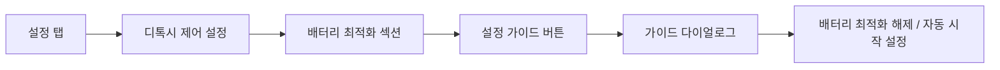
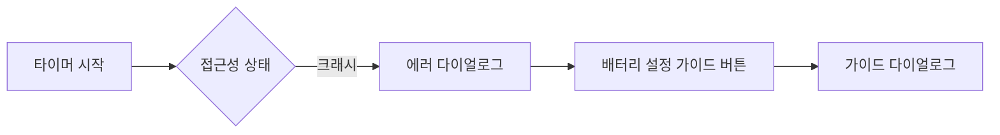

# 배터리 최적화 가이드 기능 구현

## 작업 정보

| 항목 | 내용 |
|-----|------|
| **작업일자** | 2026-01-07 ~ 2026-01-08 |
| **버전** | v1.1.0 |
| **작업자** | AI Assistant |

---

## 📋 작업 배경

### 문제 상황

접근성 서비스(`FocusAccessibilityService`)가 장기간 사용 시 크래시되는 문제 발생.

**로그 분석 결과:**
```
Process com.allday.detoxy (pid 27754) has died: cch+65 CEM
SmartPower: com.allday.detoxy/10611(20536): died->background
```

### 근본 원인

**OEM 배터리 최적화(Xiaomi SmartPower 등)가 앱 프로세스를 강제 종료**

- `cch+65 CEM` = Cached Empty Process로 분류되어 시스템이 종료
- 접근성 서비스가 앱 프로세스 내에서 실행되므로 함께 종료됨

**결론:** 프로그래밍으로 완전히 해결 불가. 사용자가 수동으로 배터리 최적화 예외 설정 필요.

---

## ✅ 구현 내용

### 1. BatteryOptimizationUtils.kt (신규)

**경로:** `app/src/main/java/com/allday/detoxy/core/utils/BatteryOptimizationUtils.kt`

- 제조사 식별 (`Xiaomi`, `Samsung`, `Huawei`, `OnePlus`, `Oppo`, `Vivo`, `Realme` 등)
- 적극적 최적화 제조사 여부 확인
- 배터리 최적화 예외 상태 확인
- 제조사별 자동 시작 설정 화면 이동 Intent
- 제조사별 가이드 텍스트 반환

---

### 2. BatteryOptimizationGuideDialog.kt (신규)

**경로:** `app/src/main/java/com/allday/detoxy/presentation/ui/component/BatteryOptimizationGuideDialog.kt`

- `BatteryOptimizationGuideDialog`: 제조사별 가이드 다이얼로그
- `BatteryOptimizationCard`: 설정 화면용 간소화된 카드

---

### 3. DetoxyControlSettingsScreen.kt (수정)

**경로:** `app/src/main/java/com/allday/detoxy/presentation/ui/settings/focus/DetoxyControlSettingsScreen.kt`

**설정 화면에 배터리 최적화 섹션 추가:**

```kotlin
// 권한 상태 섹션 아래에 배터리 최적화 섹션 추가
BatteryOptimizationSection()
```

- 적극적 최적화 제조사에서만 표시
- "설정 가이드" 버튼 클릭 시 가이드 다이얼로그 표시

---

### 4. TimerScreen.kt (수정)

**경로:** `app/src/main/java/com/allday/detoxy/presentation/ui/timer/TimerScreen.kt`

크래시 에러 다이얼로그에 "🔋 배터리 설정 가이드" 버튼 추가.

---

### 5. AndroidManifest.xml (수정)

**배터리 최적화 예외 요청 권한 추가:**

```xml
<uses-permission android:name="android.permission.REQUEST_IGNORE_BATTERY_OPTIMIZATIONS" />
```

---

## 📁 변경된 파일 목록

| 파일 | 변경 유형 | 설명 |
|-----|----------|------|
| `AndroidManifest.xml` | 수정 | 배터리 최적화 예외 요청 권한 추가 |
| `BatteryOptimizationUtils.kt` | 신규 | 제조사별 배터리 최적화 관리 유틸리티 |
| `BatteryOptimizationGuideDialog.kt` | 신규 | 배터리 최적화 가이드 UI 컴포넌트 |
| `DetoxyControlSettingsScreen.kt` | 수정 | **설정 화면에 배터리 최적화 섹션 추가** |
| `TimerScreen.kt` | 수정 | 크래시 에러 다이얼로그에 가이드 버튼 추가 |

---

## 📱 사용자 경험 흐름

### 경로 1: 설정 화면에서 사전 설정 (권장)



### 경로 2: 크래시 발생 시 안내



---

## 🔧 리뷰 반영 사항

| 이슈 | 심각도 | 수정 내용 |
|-----|-------|----------|
| 권한 누락 | High | `REQUEST_IGNORE_BATTERY_OPTIMIZATIONS` 권한 추가 |
| 카드 조건 오류 | High | 적극적 최적화 제조사에서만 표시하도록 수정 |
| Xiaomi Intent 오타 | Medium | `MainAc498tivity` → `MainActivity` 수정 |
| 앱 이름 불일치 | Medium | `ScreenSense` → `ScreenSence`로 통일 |
| 작업 결과서 미흡 | Medium | 설정 화면 노출 및 사용자 흐름 추가 |
| 카드 디자인 불일치 | Low | 설정 화면 카드 디자인 통일 (tint 제거) |

---

## 🧪 빌드 검증

```bash
./gradlew compileDebugKotlin
# BUILD SUCCESSFUL
```

---

## ⚠️ 참고사항

1. **자동 설정 불가**: 제조사별 배터리 최적화는 프로그래밍으로 자동 설정 불가
2. **사용자 액션 필수**: 반드시 사용자가 수동으로 설정 화면에서 변경 필요
3. **Google Play 정책**: `REQUEST_IGNORE_BATTERY_OPTIMIZATIONS` 권한은 핵심 기능에 필수적인 경우에만 사용 가능

---

## 🔗 참고 자료

- [Don't Kill My App](https://dontkillmyapp.com) - 제조사별 앱 킬러 정보
- [Android Battery Optimization](https://developer.android.com/training/monitoring-device-state/doze-standby)
